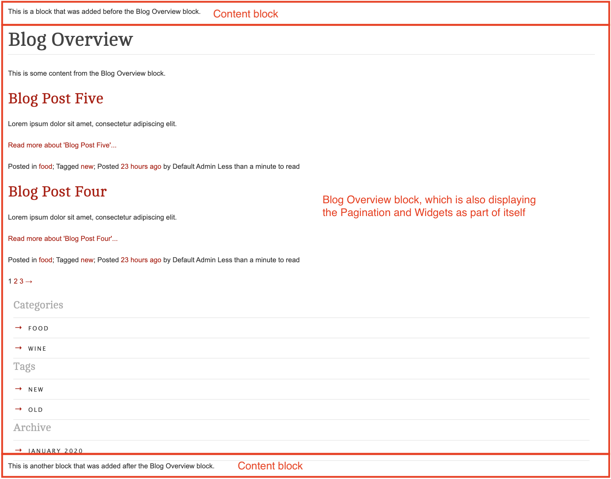
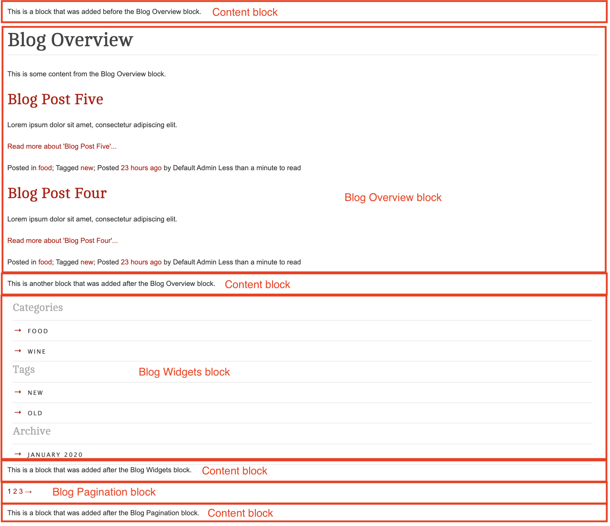

# SilverStripe Elemental Blog

Recent Blog Posts Element for the SilverStripe Elemental module.


[](https://github.com/sponsors/dynamic)

[](https://packagist.org/packages/dynamic/silverstripe-elemental-blog)
[](https://packagist.org/packages/dynamic/silverstripe-elemental-blog)
[](https://packagist.org/packages/dynamic/silverstripe-elemental-blog)
[](https://packagist.org/packages/dynamic/silverstripe-elemental-blog)

## Requirements

* SilverStripe ^6
* PHP ^8.1
* silverstripe/blog: ^5.0
* dnadesign/silverstripe-elemental: ^6.0

## Installation

`composer require dynamic/silverstripe-elemental-blog`

## Upgrading from version 3.0

SilverStripe Elemental Blog 4.0 is compatible with SilverStripe 6. Key changes:

- Updated to SilverStripe CMS 6
- Requires PHP 8.1 or higher
- Updated `silverstripe/blog` to ^5.0 (SS6 compatible)
- Updated `dnadesign/silverstripe-elemental` to ^6.0 (SS6 compatible)
- **Removed widget support** - The SilverStripe widget module is no longer supported in SS6
  - `ElementBlogWidgets` block has been removed
  - Widget-related configuration options have been removed
  - If you were using widget functionality, you will need to migrate to alternative solutions

For more information about SilverStripe 6, see the [SilverStripe 6 Upgrade Guide](https://docs.silverstripe.org/en/6/upgrading/).

## License
See [License](license.md)

## Usage

There are three blocks available for you to use. It is likely that you will not want all of them to be available to
content authors, so it is recommended that you review what the purpose of each block is, and then add the ones you don't
need to `disallowed_elements`.

The three blocks are:

* [ElementBlogPosts](#elementblogposts)
* [ElementBlogOverview](#elementblogoverview)
* [ElementBlogPagination](#elementblogpagination)

### ElementBlogPosts

A block to show a list of recent posts by a featured blog. Ideal for home pages or dashboards.

### ElementBlogOverview

The purpose of this block is to replicate the output that was originally being given by the Blog module's `Layout`
template.

**Including:**

- Title (including Category/Archive/etc titles)
- Content
- Blog Posts
- Pagination



You will likely want to override the very basic default template that has been provided, you can do so by overriding the
template found with the namespace `Dynamic\Elements\Blog\Elements\ElementBlogOverview.ss`.

#### Controlling pagination & widgets for this block

**Pagination config:**

* `pagination_field_default`: `1` (pagination is enabled by default)
* `show_pagination_field`: `true` (content authors have the ability to turn pagination on or off)

With the default configuration, when an author creates a new Overview block, they will be presented with a checkbox
to "Show pagination" (which will be ticked by default). If you do **not** want your authors to be able to disable
pagination, then you can update the `show_pagination_field` config to `false`.

```yaml
Dynamic\Elements\Blog\Elements\ElementBlogOverview:
  show_pagination_field: false
```

If you would like pagination to be turned **off** by default, then you can update the `pagination_field_default` to `0`.

```yaml
Dynamic\Elements\Blog\Elements\ElementBlogOverview:
  pagination_field_default: 0
```

#### Using this block on Page types other than `Blog`

**Please consider:** While the Overview block does support you using it on other page types, it is primarily designed to
be used on Blog page types. This is because it is `Blog` and `BlogController` that provide the relevant info to this
block.

Please consider whether you want this block to be available to other page types, and if you don't, you might want to
add this block to `disallowed_elements` on your other page types. EG:

```yaml
App\Model\Page\MyPage:
  disallowed_elements:
    - Dynamic\Elements\Blog\Elements\ElementBlogOverview
```

If you do wish this block to be available on other page types, then please review the contents on the class to see how
you can dictate what data should be provided to this block.

## ElementBlogPagination

You might decide that you would like Pagination to be displayed quite separately to the Overview block. This can be
achieved by using `ElementBlogPagination` as a separate block.

**Please consider:** Like the Overview Block, please consider removing this block from any/all Page types that you do
not want it available on. EG, if you don't want to use it at all, you can disallow it for all pages by default:

```yaml
Page:
  disallowed_elements:
    - Dynamic\Elements\Blog\Elements\ElementBlogPagination
```



## Getting more elements

See [Elemental modules by Dynamic](https://github.com/orgs/dynamic/repositories?q=elemental&type=all&language=&sort=)

## Configuration

See [SilverStripe Elemental Configuration](https://github.com/dnadesign/silverstripe-elemental#configuration)

## Maintainers
 *  [Dynamic](http://www.dynamicagency.com) (<dev@dynamicagency.com>)

## Bugtracker
Bugs are tracked in the issues section of this repository. Before submitting an issue please read over
existing issues to ensure yours is unique.

If the issue does look like a new bug:

 - Create a new issue
 - Describe the steps required to reproduce your issue, and the expected outcome. Unit tests, screenshots
 and screencasts can help here.
 - Describe your environment as detailed as possible: SilverStripe version, Browser, PHP version,
 Operating System, any installed SilverStripe modules.

Please report security issues to the module maintainers directly. Please don't file security issues in the bugtracker.

## Development and contribution
If you would like to make contributions to the module please ensure you raise a pull request and discuss with the module maintainers.