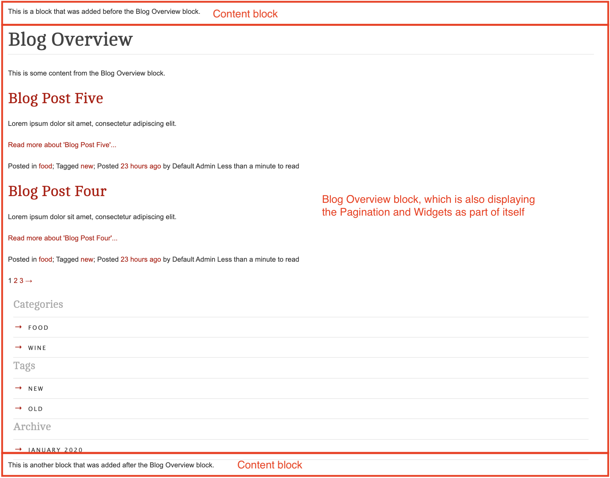
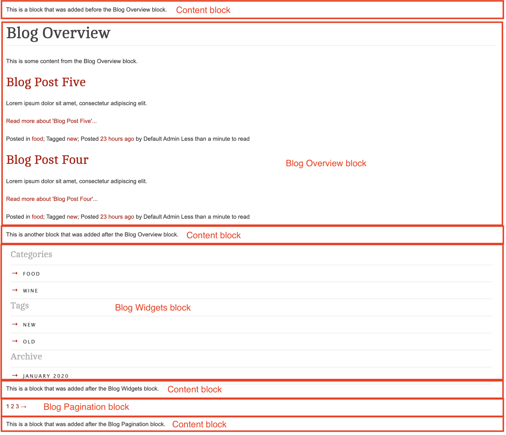

# SilverStripe Elemental Blog

Recent Blog Posts Element for the SilverStripe Elemental module.


[](https://scrutinizer-ci.com/g/dynamic/silverstripe-elemental-blog/?branch=master)
[](https://codecov.io/gh/dynamic/silverstripe-elemental-blog)

[](https://packagist.org/packages/dynamic/silverstripe-elemental-blog)
[](https://packagist.org/packages/dynamic/silverstripe-elemental-blog)
[](https://packagist.org/packages/dynamic/silverstripe-elemental-blog)
[](https://packagist.org/packages/dynamic/silverstripe-elemental-blog)

## Requirements

- silverstripe/blog: ^3.0@dev
- dnadesign/silverstripe-elemental: ^4@dev

## Installation

`composer require dynamic/silverstripe-elemental-blog`

## Usage

There are four blocks available for you to use. It is likely that you will not want all of them to be available to
content authors, so it is recommended that you review what the purpose of each block is, and then add the ones you don't
need to `disallowed_elements`.

The four blocks are:

* [ElementBlogPosts](#elementblogposts)
* [ElementBlogOverview](#elementblogoverview)
* [ElementBlogPagination](#elementblogpagination)
* [ElementBlogWidgets](#elementblogwidgets)

### ElementBlogPosts

A block to show a list of recent posts by a featured blog. Ideal for home pages or dashboards.

### ElementBlogOverview

The purpose of this block is to replicate the output that was originally being given by the Blog module's `Layout`
template.

**Including:**

- Title (including Category/Archive/etc titles)
- Content
- Blog Posts
- Pagination
- Widgets (if the addon as been added and enabled)



You will likely want to override the very basic default template that has been provided, you can do so by overriding the
template found with the namespace `Dynamic\Elements\Blog\Elements\ElementBlogOverview.ss`.

#### Controlling pagination & widgets for this block

**Pagination config:**

* `pagination_field_default`: `1` (pagination is enabled by default)
* `show_pagination_field`: `true` (content authors have the ability to turn pagination on or off)

With the default configuration, when an author creates a new Overview block, they will be presented with a checkbox
to "Show pagination" (which will be ticked by default). If you do **not** want your authors to be able to disable
pagination, then you can update the `show_pagination_field` config to `false`.

```yaml
Dynamic\Elements\Blog\Elements\ElementBlogOverview:
  show_pagination_field: false
```

If you would like pagination to be turned **off** by default, then you can update the `pagination_field_default` to `0`.

```yaml
Dynamic\Elements\Blog\Elements\ElementBlogOverview:
  pagination_field_default: 0
```

**Widget config:**

* `widgets_field_default`: `0` (widgets are disabled by default)
* `show_widgets_field`: `false` (the "Show widgets" field is not displayed to authors by default)

Because the Widget module is an optional addon, the default settings for Widgets is for them to be disabled. You have
the same control over the Widgets config as you do for Pagination.

#### Using this block on Page types other than `Blog`

**Please consider:** While the Overview block does support you using it on other page types, it is primarily designed to
be used on Blog page types. This is because it is `Blog` and `BlogController` that provide the relevant info to this
block.

Please consider whether you want this block to be available to other page types, and if you don't, you might want to
add this block to `disallowed_elements` on your other page types. EG:

```yaml
App\Model\Page\MyPage:
  disallowed_elements:
    - Dynamic\Elements\Blog\Elements\ElementBlogOverview
```

If you do wish this block to be available on other page types, then please review the contents on the class to see how
you can dictate what data should be provided to this block.

## ElementBlogPagination

You might decide that you would like Pagination to be displayed quite separately to the Overview block. This can be
achieved by using `ElementBlogPagination` as a separate block.

**Please consider:** Like the Overview Block, please consider removing this block from any/all Page types that you do
not want it available on. EG, if you don't want to use it at all, you can disallow it for all pages by default:

```yaml
Page:
  disallowed_elements:
    - Dynamic\Elements\Blog\Elements\ElementBlogPagination
```



## ElementBlogWidgets

You might decide that you would like Blog Widgets to be displayed quite separately to the Overview. This can be
achieved by using `ElementBlogWidgets` as a separate block.

**Please consider:** Like the Overview Block, please consider removing this block from any/all Page types that you do
not want it available on. EG, if you don't want to use it at all, you can disallow it for all pages by default:

```yaml
Page:
  disallowed_elements:
    - Dynamic\Elements\Blog\Elements\ElementBlogWidgets
```

## Screen Shots

#### Front End sample of a Blog Element


#### CMS - Blog Element Main Tab


## Getting more elements

See [Elemental modules by Dynamic](https://github.com/dynamic/silverstripe-elemental-blocks#getting-more-elements)

## Configuration

See [SilverStripe Elemental Configuration](https://github.com/dnadesign/silverstripe-elemental#configuration)
