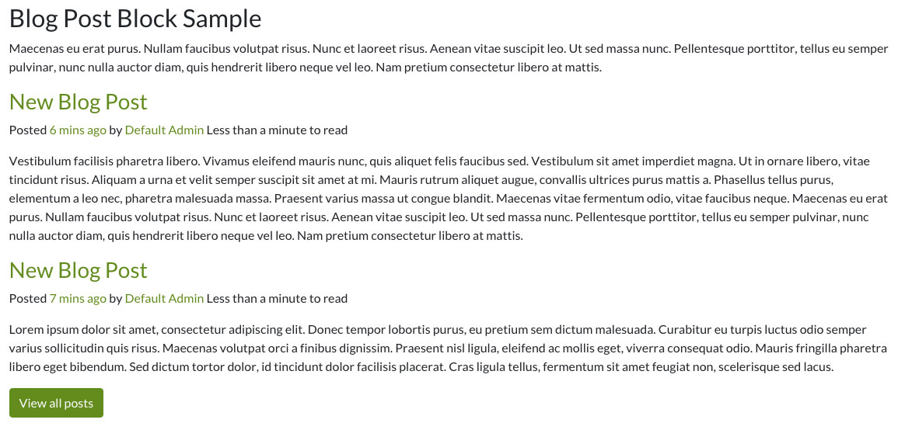
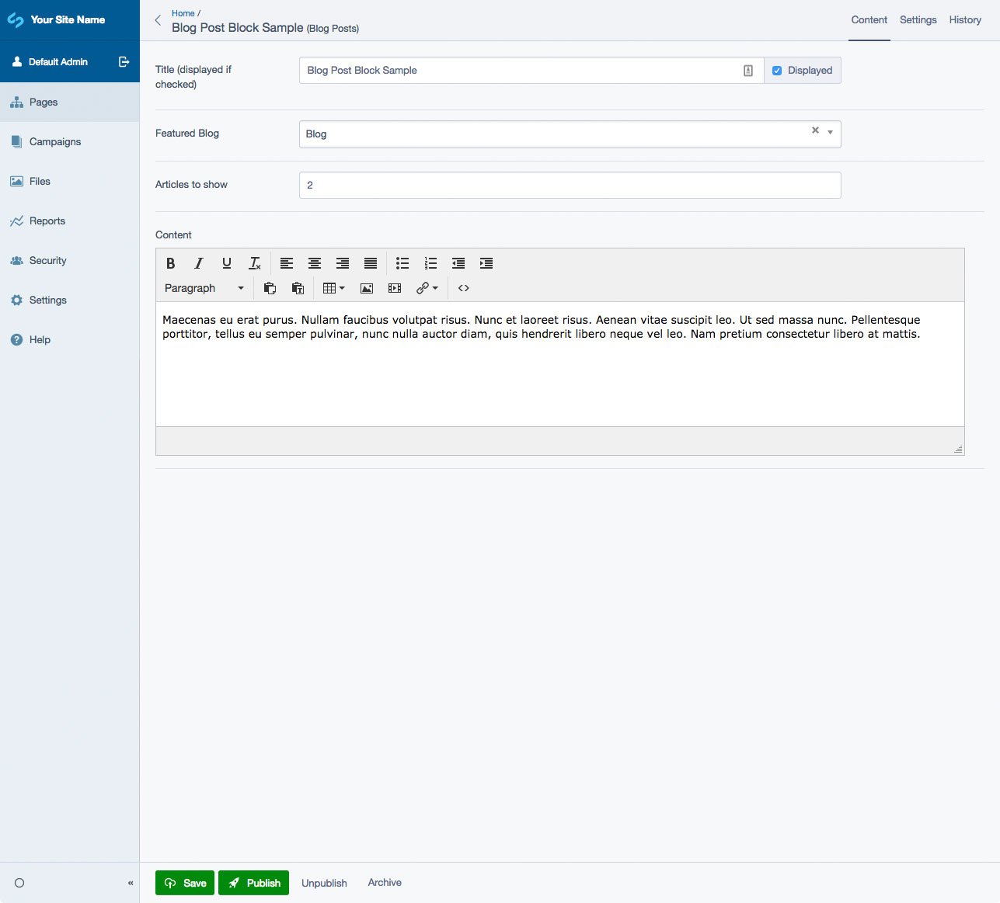

# SilverStripe Elemental Blog

Recent Blog Posts Element for the SilverStripe Elemental module.

## Requirements

- silverstripe/blog: ^3.0@dev
- dnadesign/silverstripe-elemental: ^4@dev

## Installation

`composer require dynamic/silverstripe-elemental-blog`

## Usage

A block to show a list of recent posts by a featured blog. Ideal for home pages or dashboards.

## Screen Shots

#### Front End sample of a Blog Element

#### CMS - Blog Element Main Tab

## Getting more elements

See [Elemental modules by Dynamic](https://github.com/dynamic/silverstripe-elemental-blocks#getting-more-elements)

## Configuration

See [SilverStripe Elemental Configuration](https://github.com/dnadesign/silverstripe-elemental#configuration)
